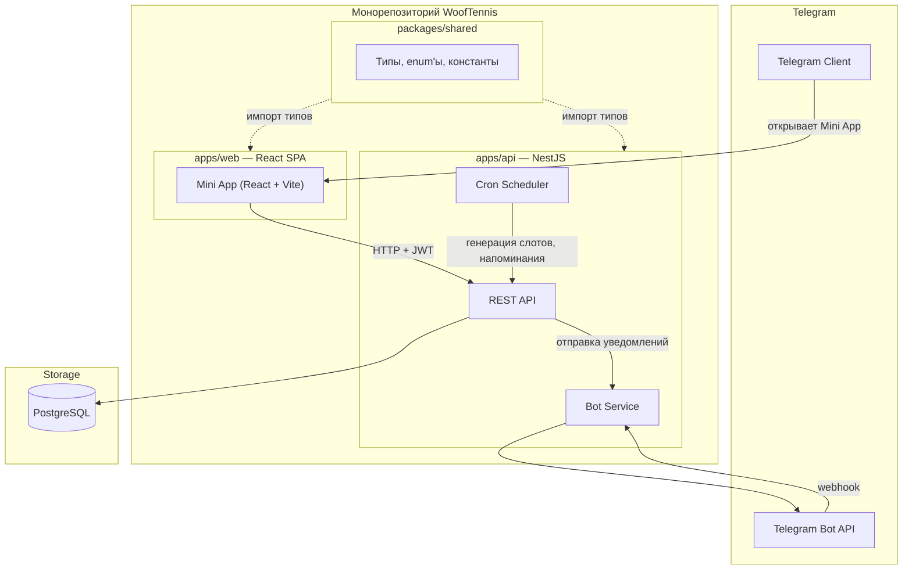
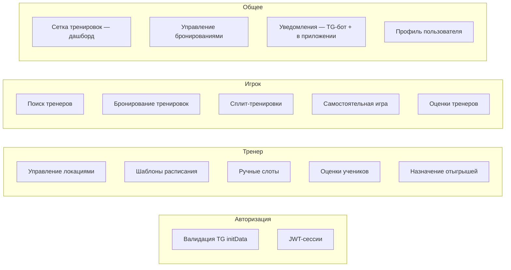

# WoofTennis — Обзор проекта

## Продукт

WoofTennis — Telegram Mini App для букинга теннисных тренировок. Приложение соединяет игроков и тренеров, позволяя бронировать индивидуальные и сплит-тренировки, а также организовывать самостоятельные игры между игроками.

### Целевая аудитория

- **Игроки** — теннисисты любого уровня, которые ищут тренера или партнёра для игры.
- **Тренеры** — теннисные тренеры, которые хотят управлять своим расписанием и базой учеников через удобный мобильный интерфейс.
- Один пользователь может совмещать обе роли.

## Ключевые принципы

| Принцип | Описание |
|---|---|
| Монорепозиторий | Единый репозиторий: `apps/api`, `apps/web`, `packages/shared`. npm workspaces + Turborepo |
| Mobile-first | Весь UI проектируется в первую очередь под мобильные устройства внутри Telegram |
| Dual-role | Пользователь одновременно может быть и тренером, и игроком |
| No payments | Приложение — только букинг, без интеграции оплат (на текущем этапе) |
| Telegram-native | Авторизация, нотификации, шаринг — всё через Telegram |
| Invite-link sharing | Самостоятельная игра v1 — через инвайт-ссылки |
| Русский язык — основной | Весь пользовательский интерфейс, сообщения об ошибках, нотификации, тексты бота — на русском. Код (переменные, API-поля) — на английском |

## Tech Stack

### Frontend

| Технология | Назначение |
|---|---|
| React 18+ | UI-фреймворк |
| Vite | Сборщик |
| TypeScript | Типизация |
| `@telegram-apps/sdk-react` | Telegram Mini App SDK |
| React Router v6 | Маршрутизация |
| Zustand | Стейт-менеджмент |
| TanStack Query (React Query) | Серверный стейт, кэширование, data fetching |
| Tailwind CSS | Стилизация |

### Backend

| Технология | Назначение |
|---|---|
| NestJS | Серверный фреймворк |
| TypeScript | Типизация |
| TypeORM | ORM |
| PostgreSQL | СУБД |
| Telegraf | Telegram Bot API |
| `@nestjs/schedule` | Cron-задачи (генерация слотов, напоминания) |
| `@nestjs/jwt` | JWT-токены для сессий |
| class-validator / class-transformer | Валидация DTO |

### Монорепо и инфраструктура

| Технология | Назначение |
|---|---|
| npm workspaces | Управление пакетами монорепозитория |
| Turborepo | Оркестрация сборки, кэширование задач |
| Docker / Docker Compose | Контейнеризация |
| Nginx | Reverse proxy, раздача SPA |
| GitHub Actions | CI/CD |

## Высокоуровневая архитектура

### Поток данных

1. Пользователь открывает Mini App внутри Telegram.
2. Telegram передаёт `initData` в Mini App (подписанные данные пользователя).
3. Mini App отправляет `initData` на бэкенд для валидации.
4. Бэкенд проверяет HMAC-подпись, создаёт/находит пользователя, возвращает JWT.
5. Все дальнейшие запросы идут с JWT в `Authorization` header.
6. Бот отправляет push-нотификации пользователям через Telegram Bot API.

## Функциональные блоки

## Роли и доступ

Система не имеет отдельной регистрации ролей. Каждый пользователь по умолчанию — игрок. Активация роли тренера происходит через переключатель в профиле (`isCoach: true`). После этого пользователю становятся доступны тренерские экраны и функции.

| Действие | Игрок | Тренер |
|---|---|---|
| Искать тренеров и бронировать слоты | + | + (как игрок) |
| Создавать самостоятельные сессии | + | + (как игрок) |
| Открывать бронирование для сплита | + | — |
| Управлять локациями | — | + |
| Настраивать расписание и слоты | — | + |
| Оценивать после тренировки | + (тренера) | + (ученика) |
| Назначать отыгрыш | — | + |
| Видеть свою сетку тренировок | + | + |
