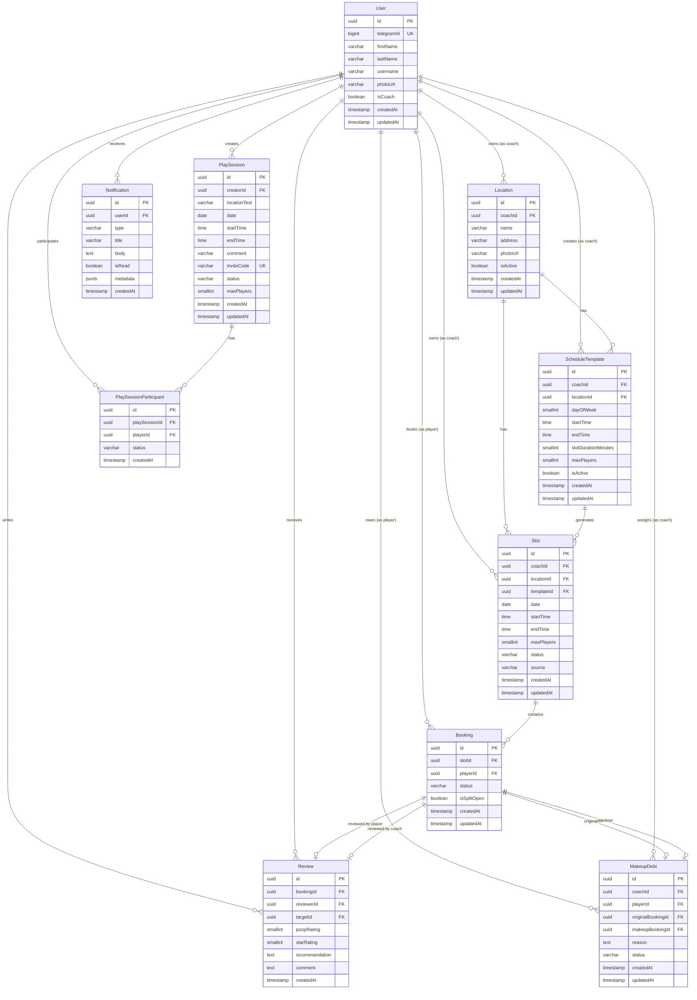

# WoofTennis — Модель данных

## ER-диаграмма



## Описание сущностей

### User

Единая сущность пользователя. Связана с Telegram-аккаунтом. Роль тренера активируется флагом `isCoach`.

| Поле | Тип | Constraints | Описание |
|---|---|---|---|
| `id` | `uuid` | PK, default gen_random_uuid() | Внутренний идентификатор |
| `telegramId` | `bigint` | UNIQUE, NOT NULL | Telegram user ID |
| `firstName` | `varchar(100)` | NOT NULL | Имя из Telegram |
| `lastName` | `varchar(100)` | NULL | Фамилия из Telegram |
| `username` | `varchar(100)` | NULL | Username из Telegram |
| `photoUrl` | `varchar(500)` | NULL | URL аватара из Telegram |
| `isCoach` | `boolean` | NOT NULL, default false | Активирована ли роль тренера |
| `createdAt` | `timestamp` | NOT NULL, default now() | Дата создания |
| `updatedAt` | `timestamp` | NOT NULL, default now() | Дата обновления |

**Индексы:**
- `UQ_user_telegram_id` — UNIQUE на `telegramId`

---

### Location

Локации, в которых тренер проводит тренировки.

| Поле | Тип | Constraints | Описание |
|---|---|---|---|
| `id` | `uuid` | PK | Идентификатор |
| `coachId` | `uuid` | FK → User.id, NOT NULL | Тренер-владелец |
| `name` | `varchar(200)` | NOT NULL | Название (напр. "Корт на Парке Горького") |
| `address` | `varchar(500)` | NOT NULL | Адрес |
| `photoUrl` | `varchar(500)` | NULL | Фото локации |
| `isActive` | `boolean` | NOT NULL, default true | Активна ли локация |
| `createdAt` | `timestamp` | NOT NULL, default now() | |
| `updatedAt` | `timestamp` | NOT NULL, default now() | |

**Индексы:**
- `IDX_location_coach_id` — на `coachId`

---

### ScheduleTemplate

Шаблон повторяющегося расписания тренера на определённый день недели в конкретной локации. Из шаблонов cron-задача генерирует конкретные слоты на N недель вперёд.

| Поле | Тип | Constraints | Описание |
|---|---|---|---|
| `id` | `uuid` | PK | |
| `coachId` | `uuid` | FK → User.id, NOT NULL | |
| `locationId` | `uuid` | FK → Location.id, NOT NULL | |
| `dayOfWeek` | `smallint` | NOT NULL, CHECK (0-6) | 0 = Понедельник, 6 = Воскресенье |
| `startTime` | `time` | NOT NULL | Начало рабочего окна (напр. 09:00) |
| `endTime` | `time` | NOT NULL | Конец рабочего окна (напр. 18:00) |
| `slotDurationMinutes` | `smallint` | NOT NULL, default 60 | Длительность одного слота в минутах |
| `maxPlayers` | `smallint` | NOT NULL, default 1 | Макс. игроков на слот (1 = индивидуальная, 2-3 = сплит) |
| `isActive` | `boolean` | NOT NULL, default true | |
| `createdAt` | `timestamp` | NOT NULL, default now() | |
| `updatedAt` | `timestamp` | NOT NULL, default now() | |

**Индексы:**
- `IDX_schedule_template_coach_id` — на `coachId`
- `IDX_schedule_template_location_id` — на `locationId`
- `UQ_schedule_template_unique` — UNIQUE на (`coachId`, `locationId`, `dayOfWeek`, `startTime`) — предотвращает дублирование

**Бизнес-логика:**
- Из одного шаблона с `startTime=09:00`, `endTime=12:00`, `slotDurationMinutes=60` генерируются 3 слота: 09:00-10:00, 10:00-11:00, 11:00-12:00.

---

### Slot

Конкретный временной слот тренера на конкретную дату. Может быть сгенерирован из шаблона или создан вручную.

| Поле | Тип | Constraints | Описание |
|---|---|---|---|
| `id` | `uuid` | PK | |
| `coachId` | `uuid` | FK → User.id, NOT NULL | |
| `locationId` | `uuid` | FK → Location.id, NOT NULL | |
| `templateId` | `uuid` | FK → ScheduleTemplate.id, NULL | NULL если создан вручную |
| `date` | `date` | NOT NULL | Дата слота |
| `startTime` | `time` | NOT NULL | Время начала |
| `endTime` | `time` | NOT NULL | Время окончания |
| `maxPlayers` | `smallint` | NOT NULL, default 1 | |
| `status` | `slot_status` | NOT NULL, default 'available' | Enum: см. ниже |
| `source` | `slot_source` | NOT NULL | Enum: template / manual |
| `createdAt` | `timestamp` | NOT NULL, default now() | |
| `updatedAt` | `timestamp` | NOT NULL, default now() | |

**Индексы:**
- `IDX_slot_coach_date` — на (`coachId`, `date`)
- `IDX_slot_location_date` — на (`locationId`, `date`)
- `UQ_slot_no_overlap` — UNIQUE на (`coachId`, `date`, `startTime`) — предотвращает пересечение слотов

---

### Booking

Бронирование игроком конкретного слота.

| Поле | Тип | Constraints | Описание |
|---|---|---|---|
| `id` | `uuid` | PK | |
| `slotId` | `uuid` | FK → Slot.id, NOT NULL | |
| `playerId` | `uuid` | FK → User.id, NOT NULL | |
| `status` | `booking_status` | NOT NULL, default 'confirmed' | Enum: см. ниже |
| `isSplitOpen` | `boolean` | NOT NULL, default false | Открыто ли для присоединения другого игрока |
| `createdAt` | `timestamp` | NOT NULL, default now() | |
| `updatedAt` | `timestamp` | NOT NULL, default now() | |

**Индексы:**
- `IDX_booking_slot_id` — на `slotId`
- `IDX_booking_player_id` — на `playerId`
- `UQ_booking_slot_player` — UNIQUE на (`slotId`, `playerId`) — один игрок не может забронировать один слот дважды

**Бизнес-логика:**
- При создании бронирования проверяется, что количество активных бронирований на слоте < `slot.maxPlayers`.
- Когда достигнут `maxPlayers`, статус слота меняется на `full`.
- Игрок может отметить `isSplitOpen = true`, чтобы другие игроки могли видеть и присоединиться к слоту.

---

### PlaySession

Самостоятельная игра между игроками (без тренера). В v1 — через инвайт-ссылку.

| Поле | Тип | Constraints | Описание |
|---|---|---|---|
| `id` | `uuid` | PK | |
| `creatorId` | `uuid` | FK → User.id, NOT NULL | Кто создал |
| `locationText` | `varchar(500)` | NOT NULL | Свободное описание места |
| `date` | `date` | NOT NULL | |
| `startTime` | `time` | NOT NULL | |
| `endTime` | `time` | NULL | Опционально |
| `comment` | `text` | NULL | Комментарий от создателя |
| `inviteCode` | `varchar(20)` | UNIQUE, NOT NULL | Код для инвайт-ссылки |
| `status` | `play_session_status` | NOT NULL, default 'open' | Enum: см. ниже |
| `maxPlayers` | `smallint` | NOT NULL, default 2 | Макс. участников (включая создателя) |
| `createdAt` | `timestamp` | NOT NULL, default now() | |
| `updatedAt` | `timestamp` | NOT NULL, default now() | |

**Индексы:**
- `UQ_play_session_invite_code` — UNIQUE на `inviteCode`
- `IDX_play_session_creator_id` — на `creatorId`
- `IDX_play_session_date` — на `date`

---

### PlaySessionParticipant

Участники самостоятельной игровой сессии.

| Поле | Тип | Constraints | Описание |
|---|---|---|---|
| `id` | `uuid` | PK | |
| `playSessionId` | `uuid` | FK → PlaySession.id, NOT NULL | |
| `playerId` | `uuid` | FK → User.id, NOT NULL | |
| `status` | `participant_status` | NOT NULL, default 'confirmed' | Enum: см. ниже |
| `createdAt` | `timestamp` | NOT NULL, default now() | |

**Индексы:**
- `UQ_participant_unique` — UNIQUE на (`playSessionId`, `playerId`)

**Бизнес-логика:**
- Создатель сессии автоматически добавляется как участник со статусом `confirmed`.

---

### Review

Взаимная оценка после тренировки. И тренер, и игрок могут оставить отзыв.

| Поле | Тип | Constraints | Описание |
|---|---|---|---|
| `id` | `uuid` | PK | |
| `bookingId` | `uuid` | FK → Booking.id, NOT NULL | К какому бронированию относится |
| `reviewerId` | `uuid` | FK → User.id, NOT NULL | Кто оставил |
| `targetId` | `uuid` | FK → User.id, NOT NULL | Кому адресовано |
| `poopRating` | `smallint` | NOT NULL, CHECK (1-3) | Рейтинг "какашка" (1-3) |
| `starRating` | `smallint` | NOT NULL, CHECK (1-3) | Рейтинг "звезда" (1-3) |
| `recommendation` | `text` | NULL | Рекомендации в свободной форме |
| `comment` | `text` | NULL | Комментарий |
| `createdAt` | `timestamp` | NOT NULL, default now() | |

**Индексы:**
- `UQ_review_unique` — UNIQUE на (`bookingId`, `reviewerId`) — один отзыв на бронирование от одного автора
- `IDX_review_target_id` — на `targetId`

**Бизнес-логика:**
- Отзыв можно оставить только после того, как бронирование перешло в статус `completed`.
- `poopRating`: 1 = одна какашка (плохо), 3 = три какашки (очень плохо).
- `starRating`: 1 = одна звезда (нормально), 3 = три звезды (отлично).

---

### MakeupDebt

Отслеживание "отыгрышей" — когда игрок пропустил тренировку и тренер назначает ему обязательство отыграть.

| Поле | Тип | Constraints | Описание |
|---|---|---|---|
| `id` | `uuid` | PK | |
| `coachId` | `uuid` | FK → User.id, NOT NULL | Тренер, назначивший отыгрыш |
| `playerId` | `uuid` | FK → User.id, NOT NULL | Игрок-должник |
| `originalBookingId` | `uuid` | FK → Booking.id, NOT NULL | Пропущенная тренировка |
| `makeupBookingId` | `uuid` | FK → Booking.id, NULL | Бронирование-отыгрыш (заполняется при резолве) |
| `reason` | `text` | NULL | Причина / комментарий тренера |
| `status` | `makeup_status` | NOT NULL, default 'pending' | Enum: см. ниже |
| `createdAt` | `timestamp` | NOT NULL, default now() | |
| `updatedAt` | `timestamp` | NOT NULL, default now() | |

**Индексы:**
- `IDX_makeup_debt_player_id` — на `playerId`
- `IDX_makeup_debt_coach_id` — на `coachId`

---

### Notification

In-app нотификации. Push-нотификации через TG-бот отправляются параллельно и не сохраняются отдельно.

| Поле | Тип | Constraints | Описание |
|---|---|---|---|
| `id` | `uuid` | PK | |
| `userId` | `uuid` | FK → User.id, NOT NULL | Получатель |
| `type` | `notification_type` | NOT NULL | Enum: см. ниже |
| `title` | `varchar(200)` | NOT NULL | Заголовок |
| `body` | `text` | NOT NULL | Текст |
| `isRead` | `boolean` | NOT NULL, default false | Прочитано ли |
| `metadata` | `jsonb` | NULL | Доп. данные (bookingId, slotId, etc.) |
| `createdAt` | `timestamp` | NOT NULL, default now() | |

**Индексы:**
- `IDX_notification_user_id_read` — на (`userId`, `isRead`) — быстрая выборка непрочитанных
- `IDX_notification_created_at` — на `createdAt` DESC — для пагинации

---

## Enum-типы

### slot_status

```sql
CREATE TYPE slot_status AS ENUM ('available', 'booked', 'full', 'cancelled');
```

| Значение | Описание |
|---|---|
| `available` | Свободен, можно бронировать |
| `booked` | Есть бронирования, но ещё есть места (для сплит-слотов) |
| `full` | Все места заняты |
| `cancelled` | Отменён тренером |

### slot_source

```sql
CREATE TYPE slot_source AS ENUM ('template', 'manual');
```

### booking_status

```sql
CREATE TYPE booking_status AS ENUM ('confirmed', 'cancelled', 'completed', 'no_show');
```

| Значение | Описание |
|---|---|
| `confirmed` | Активное бронирование |
| `cancelled` | Отменено игроком или тренером |
| `completed` | Тренировка состоялась |
| `no_show` | Игрок не пришёл |

### play_session_status

```sql
CREATE TYPE play_session_status AS ENUM ('open', 'confirmed', 'cancelled', 'completed');
```

### participant_status

```sql
CREATE TYPE participant_status AS ENUM ('confirmed', 'cancelled');
```

### makeup_status

```sql
CREATE TYPE makeup_status AS ENUM ('pending', 'resolved', 'cancelled');
```

### notification_type

```sql
CREATE TYPE notification_type AS ENUM (
  'booking_created',
  'booking_cancelled',
  'booking_reminder',
  'split_join_request',
  'split_joined',
  'play_session_invite',
  'play_session_joined',
  'review_received',
  'makeup_assigned',
  'makeup_resolved',
  'slot_cancelled'
);
```

## Правила каскадного удаления

| Родитель | Потомок | Действие при удалении |
|---|---|---|
| User | Location | CASCADE |
| User | Booking | RESTRICT (нельзя удалить пользователя с бронированиями) |
| Location | Slot | CASCADE |
| Location | ScheduleTemplate | CASCADE |
| Slot | Booking | RESTRICT |
| Booking | Review | CASCADE |
| User | Notification | CASCADE |
| PlaySession | PlaySessionParticipant | CASCADE |
