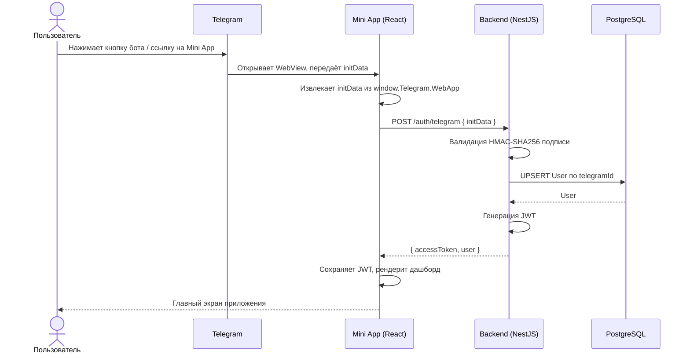
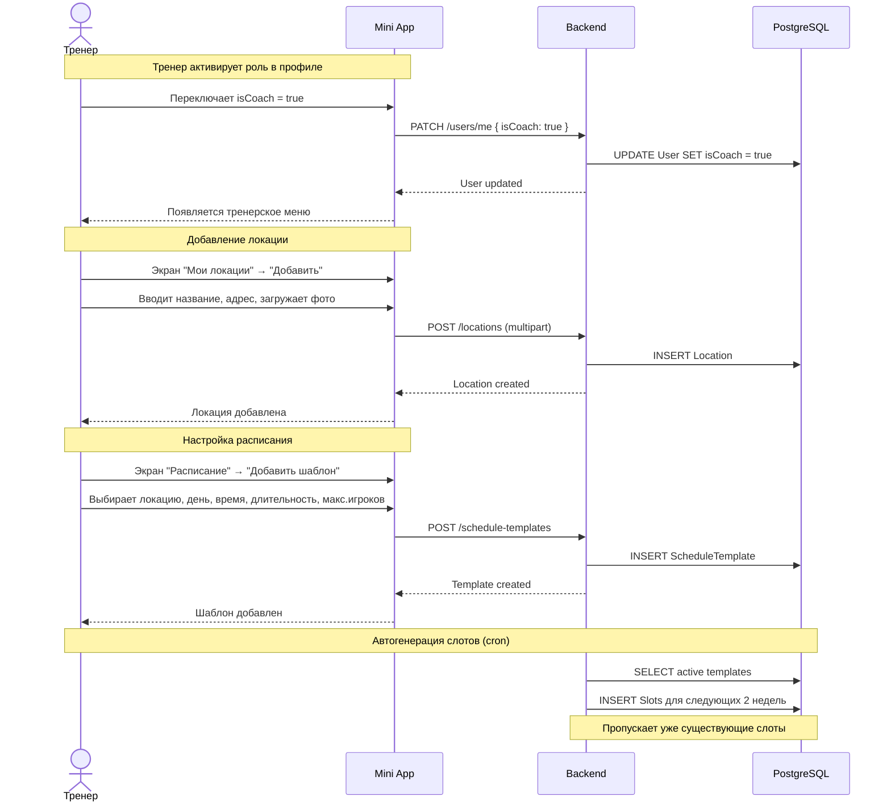
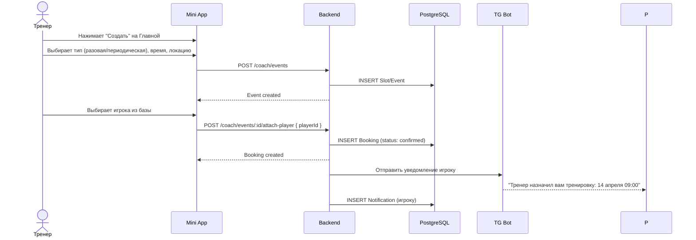
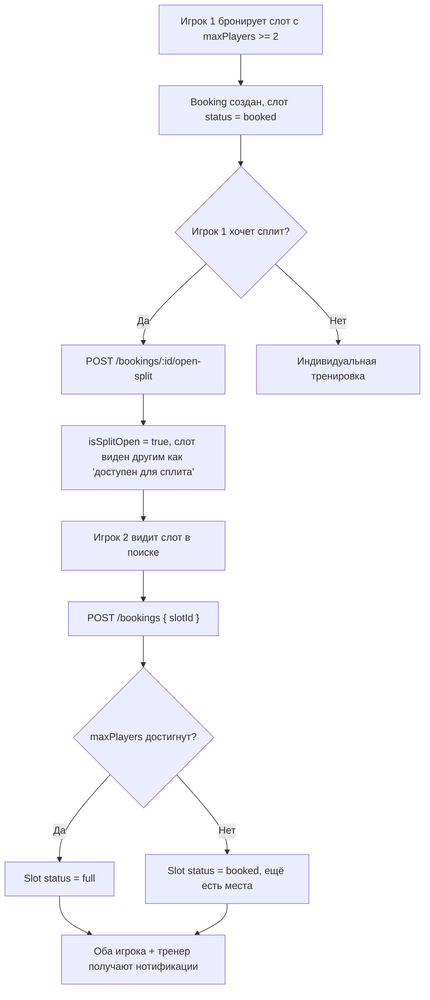
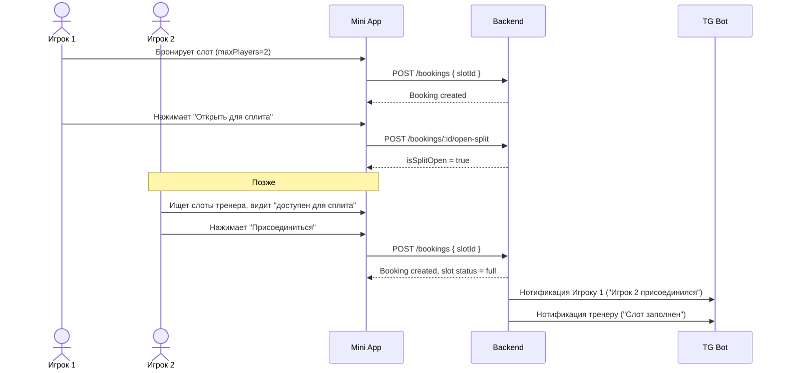
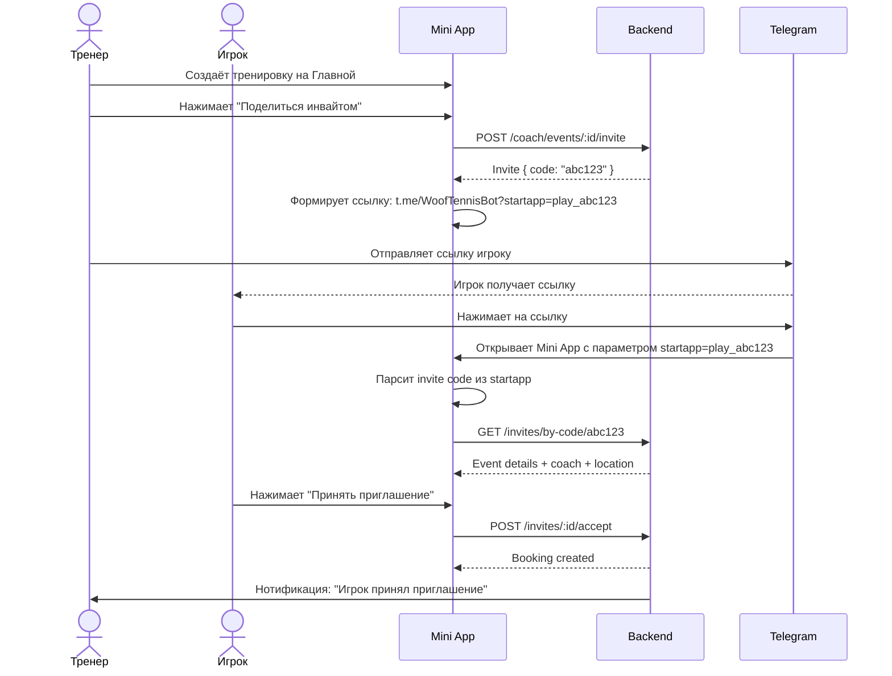
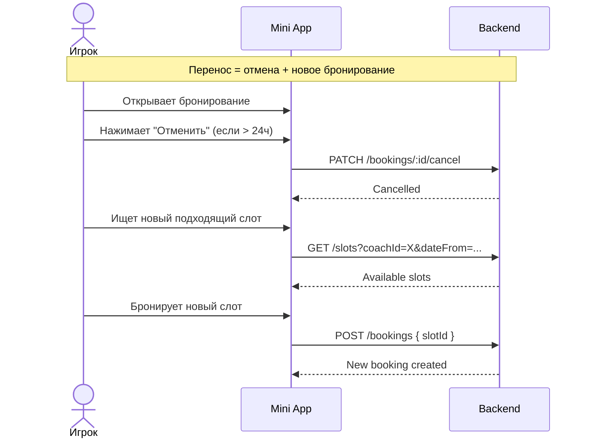
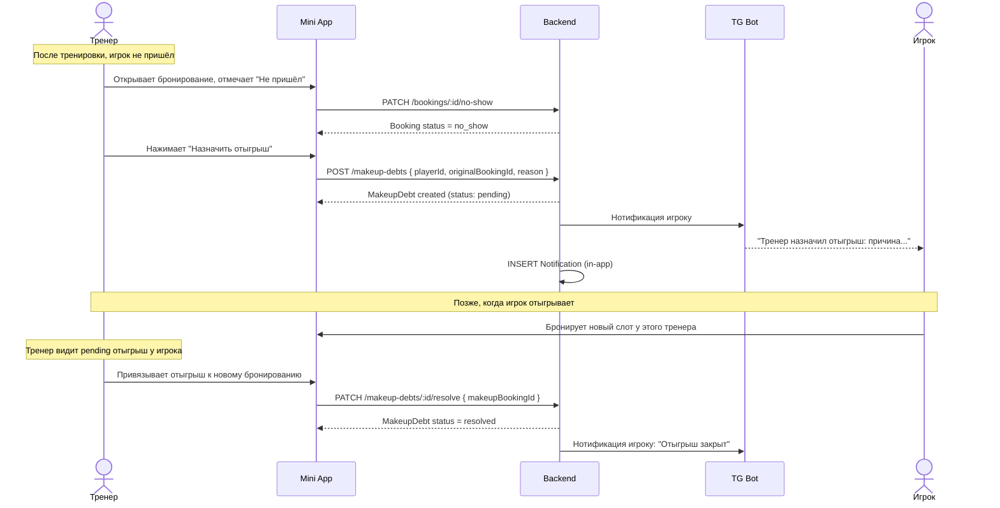
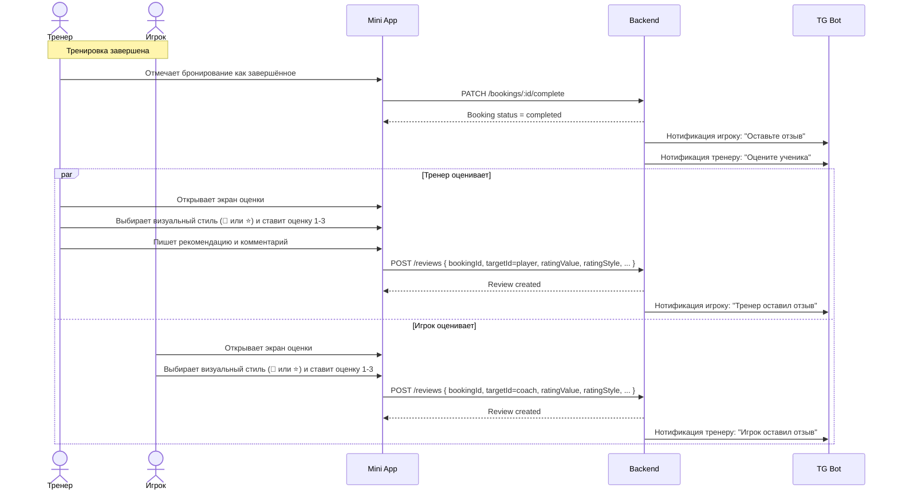
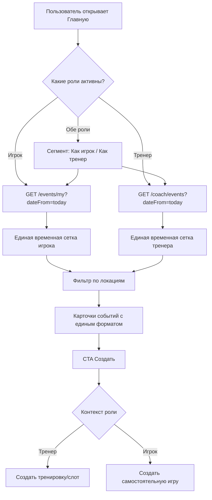

# WoofTennis — Пользовательские сценарии

## 1. Первый вход и авторизация через Telegram



---

## 2. Тренер: добавление локации и настройка расписания



---

## 3. Тренер создаёт тренировку и назначает игрока (direct-attach)



---

## 4. Сплит-тренировка



### Sequence-диаграмма сплит-тренировки



---

## 5. Приглашение по ссылке (invite)



---

## 6. Отмена и перенос тренировки

```mermaid
flowchart TD
    A[Игрок хочет отменить бронирование] --> B{До тренировки > 24ч?}
    B -->|Да| C["PATCH /bookings/:id/cancel"]
    B -->|Нет| D{Кто отменяет?}
    D -->|Игрок| E["400: Отмена запрещена менее чем за 24ч"]
    D -->|Тренер| F["Тренер может отменить в любое время"]
    
    C --> G[Booking status = cancelled]
    F --> G
    
    G --> H[Пересчёт статуса слота]
    H --> I{Был full?}
    I -->|Да| J["Slot status → booked или available"]
    I -->|Нет| K["Slot status без изменений"]
    
    G --> L[Нотификация другой стороне]
    
    Note over E: Игрок может связаться с тренером
    Note over E: для согласования переноса
```

### Перенос тренировки



---

## 7. Тренер назначает отыгрыш



---

## 8. Оценка после тренировки (Review flow)



---

## 9. Дашборд — сетка тренировок



---

## 10. Сводная таблица экранов и действий

| Экран | Роль | Ключевые действия |
|---|---|---|
| Главная (сетка событий) | Игрок + Тренер | Просмотр событий по времени, фильтр по локациям, CTA "Создать" |
| Детали события | Игрок + Тренер | Подтверждение/отмена/перенос, просмотр локации и участников |
| Мои локации | Тренер | Добавление, редактирование, деактивация локаций |
| Расписание | Тренер | Добавление и редактирование шаблонов, ручное создание слотов |
| Детали слота | Тренер | Просмотр бронирований, отмена слота, завершение, отметка "не пришёл" |
| Создание события (через CTA на Главной) | Игрок + Тренер | Создание игры/тренировки, direct-attach или invite |
| Принятие приглашения | Игрок | Просмотр деталей события по инвайту и подтверждение участия |
| Оценка | Оба | Выставление единой оценки 1-3 (в формате 💩 или ⭐) и комментариев |
| Профиль | Оба | Настройки, переключение "стать тренером", кабинет тренера, архив уведомлений |
