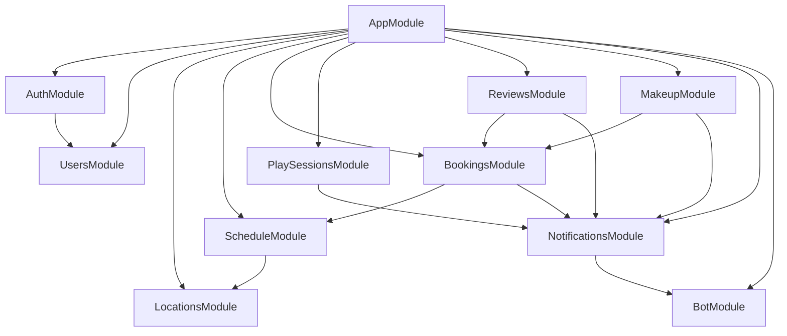

# WoofTennis — Бэкенд архитектура

## Tech Stack

| Технология | Версия | Назначение |
|---|---|---|
| NestJS | 10+ | Серверный фреймворк |
| TypeScript | 5+ | Типизация |
| TypeORM | 0.3+ | ORM + миграции |
| PostgreSQL | 15+ | СУБД |
| `@nestjs/jwt` | latest | JWT-токены |
| `@nestjs/schedule` | latest | Cron-задачи |
| `@nestjs/config` | latest | Конфигурация из .env |
| Telegraf | 4+ | Telegram Bot API |
| class-validator | latest | Валидация DTO |
| class-transformer | latest | Трансформация DTO |
| multer | latest | Загрузка файлов (фото локаций) |
| uuid | latest | Генерация UUID |

## Расположение в монорепозитории

Бэкенд живёт в `apps/api/`. Типы, enum'ы и константы импортируются из `@wooftennis/shared` (см. `10-monorepo-structure.md`).

## Структура проекта

```
apps/api/
├── nest-cli.json
├── tsconfig.json                        # extends ../../tsconfig.base.json
├── tsconfig.build.json
├── package.json                         # name: @wooftennis/api
├── Dockerfile
├── src/
│   ├── main.ts                          # Bootstrap, CORS, Swagger
│   ├── app.module.ts                    # Root module
│   ├── common/                          # Общие утилиты
│   │   ├── decorators/
│   │   │   ├── current-user.decorator.ts  # @CurrentUser() param decorator
│   │   │   └── coach-only.decorator.ts    # @CoachOnly() method decorator
│   │   ├── guards/
│   │   │   ├── jwt-auth.guard.ts          # JWT-валидация
│   │   │   └── coach.guard.ts             # Проверка isCoach
│   │   ├── interceptors/
│   │   │   └── transform.interceptor.ts   # Стандартизация ответов
│   │   ├── filters/
│   │   │   └── http-exception.filter.ts   # Единый формат ошибок
│   │   ├── pipes/
│   │   │   └── uuid-validation.pipe.ts
│   │   ├── dto/
│   │   │   └── pagination.dto.ts          # PaginationQueryDto, PaginatedResponseDto
│   │   └── utils/
│   │       ├── telegram-auth.util.ts      # HMAC-SHA256 валидация initData
│   │       └── invite-code.util.ts        # Генерация коротких invite-кодов
│   ├── config/
│   │   ├── database.config.ts             # TypeORM configuration
│   │   ├── jwt.config.ts
│   │   └── telegram.config.ts
│   ├── modules/
│   │   ├── auth/
│   │   │   ├── auth.module.ts
│   │   │   ├── auth.controller.ts         # POST /auth/telegram
│   │   │   ├── auth.service.ts            # Валидация initData, JWT
│   │   │   ├── dto/
│   │   │   │   ├── telegram-auth.dto.ts   # { initData: string }
│   │   │   │   └── auth-response.dto.ts   # { accessToken, user }
│   │   │   └── strategies/
│   │   │       └── jwt.strategy.ts        # Passport JWT strategy
│   │   ├── users/
│   │   │   ├── users.module.ts
│   │   │   ├── users.controller.ts        # GET /users/me, PATCH, GET /:id/public
│   │   │   ├── users.service.ts
│   │   │   ├── entities/
│   │   │   │   └── user.entity.ts
│   │   │   └── dto/
│   │   │       ├── update-user.dto.ts
│   │   │       └── user-response.dto.ts
│   │   ├── locations/
│   │   │   ├── locations.module.ts
│   │   │   ├── locations.controller.ts    # CRUD /locations
│   │   │   ├── locations.service.ts
│   │   │   ├── entities/
│   │   │   │   └── location.entity.ts
│   │   │   └── dto/
│   │   │       ├── create-location.dto.ts
│   │   │       └── update-location.dto.ts
│   │   ├── schedule/
│   │   │   ├── schedule.module.ts
│   │   │   ├── templates/
│   │   │   │   ├── templates.controller.ts  # CRUD /schedule-templates
│   │   │   │   ├── templates.service.ts
│   │   │   │   ├── entities/
│   │   │   │   │   └── schedule-template.entity.ts
│   │   │   │   └── dto/
│   │   │   │       ├── create-template.dto.ts
│   │   │   │       └── update-template.dto.ts
│   │   │   └── slots/
│   │   │       ├── slots.controller.ts      # GET /slots, POST, PATCH, POST /generate
│   │   │       ├── slots.service.ts
│   │   │       ├── slot-generator.service.ts # Генерация слотов из шаблонов
│   │   │       ├── entities/
│   │   │       │   └── slot.entity.ts
│   │   │       └── dto/
│   │   │           ├── create-slot.dto.ts
│   │   │           ├── update-slot.dto.ts
│   │   │           ├── query-slots.dto.ts
│   │   │           └── generate-slots.dto.ts
│   │   ├── bookings/
│   │   │   ├── bookings.module.ts
│   │   │   ├── bookings.controller.ts     # POST, PATCH, GET /bookings/*
│   │   │   ├── bookings.service.ts
│   │   │   ├── entities/
│   │   │   │   └── booking.entity.ts
│   │   │   └── dto/
│   │   │       ├── create-booking.dto.ts
│   │   │       ├── cancel-booking.dto.ts
│   │   │       └── query-bookings.dto.ts
│   │   ├── play-sessions/
│   │   │   ├── play-sessions.module.ts
│   │   │   ├── play-sessions.controller.ts
│   │   │   ├── play-sessions.service.ts
│   │   │   ├── entities/
│   │   │   │   ├── play-session.entity.ts
│   │   │   │   └── play-session-participant.entity.ts
│   │   │   └── dto/
│   │   │       ├── create-play-session.dto.ts
│   │   │       └── query-play-sessions.dto.ts
│   │   ├── reviews/
│   │   │   ├── reviews.module.ts
│   │   │   ├── reviews.controller.ts
│   │   │   ├── reviews.service.ts
│   │   │   ├── entities/
│   │   │   │   └── review.entity.ts
│   │   │   └── dto/
│   │   │       ├── create-review.dto.ts
│   │   │       └── query-reviews.dto.ts
│   │   ├── makeup/
│   │   │   ├── makeup.module.ts
│   │   │   ├── makeup.controller.ts
│   │   │   ├── makeup.service.ts
│   │   │   ├── entities/
│   │   │   │   └── makeup-debt.entity.ts
│   │   │   └── dto/
│   │   │       ├── create-makeup-debt.dto.ts
│   │   │       └── resolve-makeup-debt.dto.ts
│   │   ├── notifications/
│   │   │   ├── notifications.module.ts
│   │   │   ├── notifications.controller.ts # GET, PATCH /notifications/*
│   │   │   ├── notifications.service.ts    # In-app нотификации (CRUD в БД)
│   │   │   ├── telegram-notifier.service.ts# Отправка push через TG Bot
│   │   │   ├── entities/
│   │   │   │   └── notification.entity.ts
│   │   │   └── dto/
│   │   │       └── query-notifications.dto.ts
│   │   └── bot/
│   │       ├── bot.module.ts
│   │       ├── bot.service.ts             # Telegraf bot: webhook, commands
│   │       └── bot.update.ts              # Обработчики команд бота
│   └── migrations/                        # TypeORM миграции
│       ├── 1713000000000-InitialSchema.ts
│       └── ...
└── test/
    ├── app.e2e-spec.ts
    └── ...
```

**Что не хранится в apps/api:**
- Enum'ы (`BookingStatus`, `SlotStatus` и т.д.) — в `@wooftennis/shared`, импортируются как `import { BookingStatus } from '@wooftennis/shared'`
- Типы интерфейсов API-ответов (`User`, `Booking` и т.д.) — в `@wooftennis/shared`
- Константы (`DAYS_OF_WEEK`, `ALLOWED_SLOT_DURATIONS`) — в `@wooftennis/shared`

TypeORM-сущности (`*.entity.ts`) остаются в `apps/api`, но используют enum'ы из shared.

## Модули и их зависимости



## Детали модулей

### AuthModule

**Ответственность:** Валидация Telegram initData, управление JWT-сессиями.

**Ключевая логика:**

```typescript
// telegram-auth.util.ts — алгоритм валидации
function validateInitData(initData: string, botToken: string): boolean {
  // 1. Распарсить initData как URLSearchParams
  // 2. Извлечь hash
  // 3. Отсортировать остальные params по ключу
  // 4. Создать data_check_string (key=value через \n)
  // 5. secret_key = HMAC-SHA256("WebAppData", botToken)
  // 6. Проверить HMAC-SHA256(secret_key, data_check_string) === hash
  // 7. Проверить auth_date не старше 24 часов
}
```

**JWT Payload:**

```typescript
interface JwtPayload {
  sub: string;       // user.id (UUID)
  telegramId: number;
  iat: number;
  exp: number;       // 7 дней
}
```

### UsersModule

**Ответственность:** CRUD пользователей, публичные профили.

**Сервис:**
- `findByTelegramId(telegramId)` — поиск по TG ID
- `upsertFromTelegram(telegramUserData)` — создание или обновление при авторизации
- `getPublicProfile(userId)` — публичный профиль со статистикой
- `updateProfile(userId, dto)` — обновление (isCoach toggle)

### LocationsModule

**Ответственность:** CRUD тренерских локаций, загрузка фото.

**Загрузка фото:**
- Используется `@UseInterceptors(FileInterceptor('photo'))` из `@nestjs/platform-express`
- Файлы сохраняются в `uploads/locations/` (в будущем — S3)
- Статическая раздача через `ServeStaticModule` или Nginx

### ScheduleModule

**Ответственность:** Шаблоны расписания и управление слотами.

**SlotGeneratorService:**

```typescript
import { SlotStatus, SlotSource } from '@wooftennis/shared';

async generateSlotsForPeriod(coachId: string, dateFrom: Date, dateTo: Date) {
  // 1. Получить все активные шаблоны тренера
  // 2. Для каждого дня в периоде:
  //    a. Определить dayOfWeek
  //    b. Найти подходящие шаблоны
  //    c. Разбить окно (startTime–endTime) на слоты по slotDurationMinutes
  //    d. Создать слоты, пропуская уже существующие (UPSERT по coachId+date+startTime)
  // 3. Вернуть { generated, skipped }
}
```

**Cron-задача (генерация слотов):**

```typescript
@Cron(CronExpression.EVERY_DAY_AT_2AM)
async autoGenerateSlots() {
  // Для всех активных тренеров:
  // Генерировать слоты на 2 недели вперёд
}
```

### BookingsModule

**Ответственность:** Бронирование, отмена, сплиты, статусы.

**Ключевая бизнес-логика:**

1. **Создание бронирования:**
   - Проверка: слот `available` или `booked` (при maxPlayers > 1)
   - Проверка: количество активных бронирований < `slot.maxPlayers`
   - Проверка: нет конфликтов по времени у игрока
   - Создание Booking (status: `confirmed`)
   - Обновление статуса слота (`booked` / `full`)
   - Нотификация тренеру

2. **Отмена бронирования:**
   - Проверка: до тренировки > 24 часов (для игрока)
   - Тренер может отменить в любое время
   - Booking → `cancelled`
   - Пересчёт статуса слота
   - Нотификация другой стороне

3. **Открытие для сплита:**
   - Проверка: `slot.maxPlayers > 1`
   - `isSplitOpen = true`
   - Слот становится видимым в поиске с пометкой "сплит"

### PlaySessionsModule

**Ответственность:** Самостоятельные игровые сессии, инвайт-ссылки.

**Генерация invite code:**

```typescript
function generateInviteCode(): string {
  // Генерирует 8-символьный код из [a-zA-Z0-9]
  // Проверяет уникальность в БД
}
```

**Deep link формат:** `https://t.me/WoofTennisBot?startapp=play_{inviteCode}`

### ReviewsModule

**Ответственность:** Оценки после тренировок.

**Валидация:**
- Бронирование в статусе `completed`
- Reviewer — участник бронирования (игрок или тренер слота)
- Target — другой участник
- Один отзыв на пару (booking + reviewer)

### MakeupModule

**Ответственность:** Учёт отыгрышей.

**Флоу:**
1. Тренер отмечает booking как `no_show`
2. Тренер создаёт MakeupDebt (status: `pending`)
3. Игрок бронирует новый слот
4. Тренер привязывает MakeupDebt к новому booking → `resolved`

### NotificationsModule

**Ответственность:** Двухканальные нотификации (in-app + Telegram push). Все тексты нотификаций — на русском языке.

**Интерфейс сервиса:**

```typescript
import { NotificationType } from '@wooftennis/shared';

interface NotificationPayload {
  userId: string;
  type: NotificationType;
  title: string;
  body: string;
  metadata?: Record<string, any>;
}

class NotificationsService {
  async send(payload: NotificationPayload): Promise<void> {
    // 1. Сохранить в БД (in-app)
    await this.notificationRepo.save({ ...payload, isRead: false });

    // 2. Отправить через Telegram Bot
    await this.telegramNotifier.send(payload.userId, payload.title, payload.body);
  }
}
```

**Шаблоны нотификаций (русский язык):**

| Тип | Заголовок | Шаблон body |
|---|---|---|
| `booking_created` | Новое бронирование | "{playerName} забронировал тренировку на {date} в {time}, {locationName}" |
| `booking_cancelled` | Отмена тренировки | "{userName} отменил тренировку {date} в {time}" |
| `booking_reminder` | Напоминание | "Тренировка через 2 часа: {time}, {locationName}" |
| `split_joined` | Новый участник сплита | "{playerName} присоединился к тренировке {date} в {time}" |
| `slot_cancelled` | Слот отменён | "Тренер отменил тренировку {date} в {time}, {locationName}" |
| `review_received` | Новый отзыв | "{reviewerName} оставил отзыв о тренировке" |
| `makeup_assigned` | Назначен отыгрыш | "Тренер {coachName} назначил отыгрыш: {reason}" |
| `makeup_resolved` | Отыгрыш закрыт | "Отыгрыш по тренировке {date} закрыт" |
| `play_session_joined` | Новый участник игры | "{playerName} присоединился к вашей игре {date}" |
| `booking_completed` | Тренировка завершена | "Тренировка завершена! Оцените тренера" |

### BotModule

**Ответственность:** Telegram Bot — webhook, команды, отправка сообщений.

**Команды бота:**
- `/start` — приветствие + кнопка открытия Mini App
- `/start play_{inviteCode}` — deep link на игровую сессию → открывает Mini App с параметром

**Webhook:** NestJS контроллер принимает webhook от Telegram и передаёт в Telegraf.

## Локализация сообщений

Все пользовательские сообщения (ошибки валидации, бизнес-логики, нотификации) возвращаются **на русском языке**. Английский язык вторичный и используется только для технических/системных логов.

Примеры сообщений об ошибках:

```typescript
throw new BadRequestException('Нельзя отменить бронирование менее чем за 24 часа до тренировки');
throw new ConflictException('Слот пересекается с существующим расписанием');
throw new NotFoundException('Бронирование не найдено');
throw new ForbiddenException('Требуется доступ тренера');
throw new BadRequestException('Все места в слоте заняты');
throw new ConflictException('Вы уже забронировали этот слот');
throw new BadRequestException('Отзыв можно оставить только после завершённой тренировки');
```

## Guards и Decorators

### JwtAuthGuard

Глобальный guard (применяется ко всем эндпоинтам кроме `/auth/telegram`):

```typescript
@Injectable()
export class JwtAuthGuard extends AuthGuard('jwt') {
  // Извлекает JWT из Authorization header
  // Верифицирует подпись
  // Добавляет user в request
}
```

### CoachGuard

Проверяет, что текущий пользователь — тренер:

```typescript
@Injectable()
export class CoachGuard implements CanActivate {
  canActivate(context: ExecutionContext): boolean {
    const user = context.switchToHttp().getRequest().user;
    if (!user.isCoach) {
      throw new ForbiddenException('Требуется доступ тренера');
    }
    return true;
  }
}
```

### @CurrentUser()

Parameter decorator для извлечения пользователя из request:

```typescript
export const CurrentUser = createParamDecorator(
  (data: keyof User | undefined, ctx: ExecutionContext) => {
    const request = ctx.switchToHttp().getRequest();
    const user = request.user;
    return data ? user?.[data] : user;
  },
);
```

### @CoachOnly()

Составной декоратор для тренерских эндпоинтов:

```typescript
export const CoachOnly = () => applyDecorators(UseGuards(CoachGuard));
```

## TypeORM Configuration

### Data Source

```typescript
export const dataSourceOptions: DataSourceOptions = {
  type: 'postgres',
  host: process.env.DB_HOST,
  port: parseInt(process.env.DB_PORT, 10),
  username: process.env.DB_USERNAME,
  password: process.env.DB_PASSWORD,
  database: process.env.DB_DATABASE,
  entities: [__dirname + '/../**/*.entity{.ts,.js}'],
  migrations: [__dirname + '/../migrations/*{.ts,.js}'],
  synchronize: false,   // Только миграции в production
  logging: process.env.NODE_ENV === 'development',
};
```

### Миграции

Стратегия: все изменения схемы — через миграции.

```bash
# Из корня монорепозитория:

# Генерация миграции из изменений в entities
npm run db:migration:generate -- -n MigrationName

# Применение миграций
npm run db:migration:run

# Или напрямую в workspace:
npm run migration:generate --workspace=@wooftennis/api -- -n MigrationName
npm run migration:run --workspace=@wooftennis/api

# Откат последней миграции
npm run migration:revert --workspace=@wooftennis/api
```

### Начальная миграция

`InitialSchema` создаёт:
1. Все enum-типы (slot_status, booking_status и т.д.)
2. Все таблицы с constraints
3. Все индексы

## Cron-задачи

| Задача | Расписание | Описание |
|---|---|---|
| `autoGenerateSlots` | Каждый день в 02:00 | Генерация слотов из шаблонов на 2 недели вперёд |
| `sendReminders` | Каждый час | Нотификации за 2 часа до тренировки |
| `completeExpiredBookings` | Каждый день в 23:00 | Автоматическое завершение прошедших бронирований |
| `cleanupExpiredSessions` | Каждый день в 01:00 | Автоматическая отмена прошедших PlaySessions со статусом `open` |

## Env-переменные

```bash
# Database
DB_HOST=localhost
DB_PORT=5432
DB_USERNAME=wooftennis
DB_PASSWORD=secret
DB_DATABASE=wooftennis

# JWT
JWT_SECRET=your-secret-key
JWT_EXPIRES_IN=7d

# Telegram
TELEGRAM_BOT_TOKEN=123456:ABC-DEF
TELEGRAM_WEBHOOK_URL=https://api.wooftennis.com/bot/webhook
TELEGRAM_MINI_APP_URL=https://wooftennis.com

# App
PORT=3000
NODE_ENV=development
UPLOAD_DIR=./uploads
```
