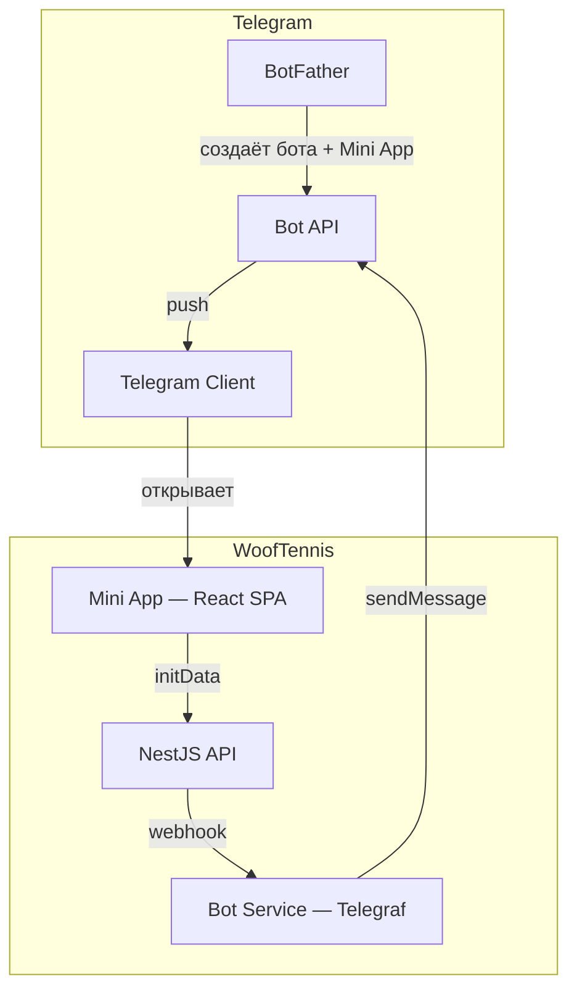
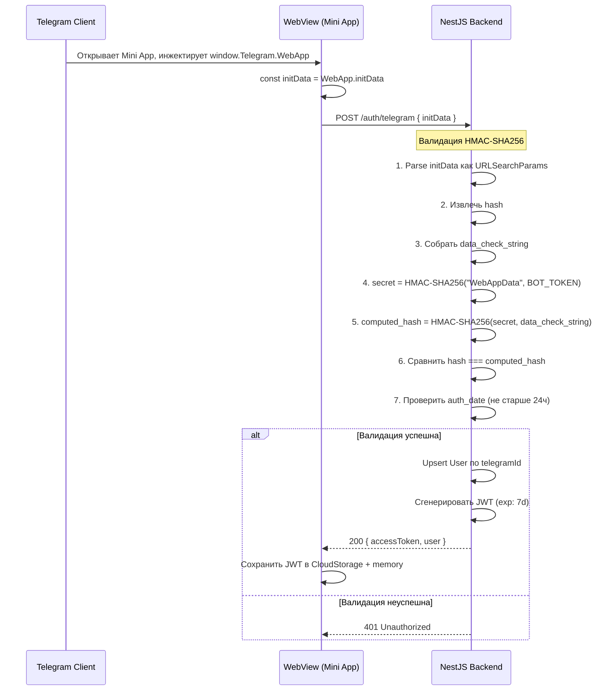
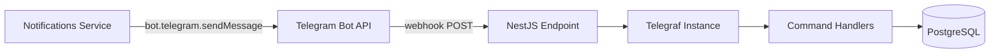

# WoofTennis — Интеграция с Telegram

## Целевая авторизация: два канала

Продуктовая цель:

1. **Сайт в браузере** — кнопка «Войти через Telegram» через [Login Widget](https://core.telegram.org/widgets/login) (отдельная проверка `hash` на сервере).
2. **Mini App** — бесшовный вход через [Web App `initData`](https://core.telegram.org/bots/webapps#validating-data-received-via-the-mini-app).

Текущие разделы ниже в основном описывают **Mini App + бот + `initData`**. Ревью разрыва с целевой моделью, алгоритмы и **задания для фронта/бэка** — в [15-auth-dual-channel-architecture.md](15-auth-dual-channel-architecture.md).

---

## Обзор компонентов



Telegram-интеграция состоит из трёх частей:
1. **Mini App** — React SPA внутри WebView Telegram
2. **Bot** — Telegram-бот для push-нотификаций и deep-linking
3. **Auth** — валидация initData на бэкенде

---

## 1. Настройка через BotFather

### Шаг 1: Создание бота

```
/newbot
Name: WoofTennis
Username: WoofTennisBot
```

Сохранить `BOT_TOKEN`.

### Шаг 2: Настройка Mini App

```
/newapp
Bot: @WoofTennisBot
Title: WoofTennis
Description: Букинг теннисных тренировок
Photo: <загрузить 640x360 изображение>
URL: https://wooftennis.com
Short name: wooftennis
```

### Шаг 3: Настройка меню бота

```
/setmenubutton
Bot: @WoofTennisBot
Type: web_app
Text: Открыть WoofTennis
URL: https://wooftennis.com
```

### Шаг 4: Настройка команд

```
/setcommands
Bot: @WoofTennisBot
start - Открыть приложение
```

---

## 2. Авторизация — initData Validation

### Флоу авторизации



### Алгоритм валидации (псевдокод)

```typescript
import { createHmac } from 'crypto';

function validateTelegramInitData(initData: string, botToken: string): TelegramUser | null {
  const params = new URLSearchParams(initData);
  const hash = params.get('hash');
  params.delete('hash');

  // Сортировка по ключу и формирование строки проверки
  const dataCheckString = Array.from(params.entries())
    .sort(([a], [b]) => a.localeCompare(b))
    .map(([key, value]) => `${key}=${value}`)
    .join('\n');

  // Вычисление HMAC
  const secretKey = createHmac('sha256', 'WebAppData')
    .update(botToken)
    .digest();

  const computedHash = createHmac('sha256', secretKey)
    .update(dataCheckString)
    .digest('hex');

  if (computedHash !== hash) {
    return null; // Invalid signature
  }

  // Проверка актуальности (не старше 24 часов)
  const authDate = parseInt(params.get('auth_date') || '0', 10);
  const now = Math.floor(Date.now() / 1000);
  if (now - authDate > 86400) {
    return null; // Expired
  }

  // Парсинг данных пользователя
  const userRaw = params.get('user');
  if (!userRaw) return null;

  return JSON.parse(userRaw) as TelegramUser;
}
```

### Структура Telegram User из initData

```typescript
interface TelegramUser {
  id: number;              // telegramId
  first_name: string;
  last_name?: string;
  username?: string;
  language_code?: string;
  is_premium?: boolean;
  photo_url?: string;
}
```

### JWT Strategy

```typescript
@Injectable()
export class JwtStrategy extends PassportStrategy(Strategy) {
  constructor(private usersService: UsersService) {
    super({
      jwtFromRequest: ExtractJwt.fromAuthHeaderAsBearerToken(),
      secretOrKey: process.env.JWT_SECRET,
    });
  }

  async validate(payload: JwtPayload): Promise<User> {
    const user = await this.usersService.findById(payload.sub);
    if (!user) throw new UnauthorizedException();
    return user;
  }
}
```

---

## 3. Telegram Mini App SDK (Frontend)

### Установка

```bash
npm install @telegram-apps/sdk-react
```

### Инициализация в main.tsx

```typescript
import { init } from '@telegram-apps/sdk-react';

// Инициализация SDK (должна быть вызвана до рендера React)
init();
```

### Используемые компоненты SDK

#### miniApp

```typescript
import { miniApp } from '@telegram-apps/sdk-react';

// Монтирование
miniApp.mount();

// Закрытие Mini App
miniApp.close();

// Готовность (убрать loading indicator)
miniApp.ready();
```

#### themeParams

```typescript
import { themeParams } from '@telegram-apps/sdk-react';

themeParams.mount();

// Доступ к цветам темы
const bgColor = themeParams.backgroundColor();
const textColor = themeParams.textColor();
const buttonColor = themeParams.buttonColor();
```

Цвета темы маппятся в CSS-переменные и используются в Tailwind (см. `05-frontend-structure.md`).

#### backButton

```typescript
import { backButton } from '@telegram-apps/sdk-react';

backButton.mount();

// Показать кнопку "Назад"
backButton.show();

// Скрыть
backButton.hide();

// Подписка на нажатие
backButton.onClick(() => {
  navigate(-1);
});
```

Интеграция с React Router: показывать `backButton` на всех страницах кроме корневой.

#### mainButton

```typescript
import { mainButton } from '@telegram-apps/sdk-react';

mainButton.mount();

// Настроить и показать
mainButton.setParams({
  text: 'Забронировать',
  isVisible: true,
  isEnabled: true,
});

// Подписка на нажатие
mainButton.onClick(() => {
  handleBooking();
});
```

Используется на экранах:
- Выбор слота → "Забронировать"
- Создание локации → "Сохранить"
- Создание игровой сессии → "Создать игру"
- Форма оценки → "Отправить оценку"
- Создание шаблона расписания → "Сохранить"

#### hapticFeedback

```typescript
import { hapticFeedback } from '@telegram-apps/sdk-react';

// Успешное действие (бронирование создано)
hapticFeedback.notificationOccurred('success');

// Ошибка (валидация)
hapticFeedback.notificationOccurred('error');

// Лёгкий отклик (нажатие кнопки)
hapticFeedback.impactOccurred('light');
```

#### cloudStorage

```typescript
import { cloudStorage } from '@telegram-apps/sdk-react';

// Сохранение JWT
await cloudStorage.setItem('jwt', token);

// Чтение JWT
const token = await cloudStorage.getItem('jwt');

// Удаление (logout)
await cloudStorage.deleteItem('jwt');
```

CloudStorage используется как persistent storage для JWT-токена, чтобы пользователь не проходил авторизацию при каждом открытии Mini App.

#### shareUrl / openTelegramLink

```typescript
import { shareURL, openTelegramLink } from '@telegram-apps/sdk-react';

// Шаринг инвайт-ссылки на игровую сессию
const inviteLink = `https://t.me/WoofTennisBot?startapp=play_${inviteCode}`;

shareURL(inviteLink, 'Присоединяйся к теннису!');
```

---

## 4. Telegram Bot

### Архитектура бота



### Webhook Setup

```typescript
@Controller('bot')
export class BotController {
  constructor(private botService: BotService) {}

  @Post('webhook')
  async handleWebhook(@Body() update: any) {
    await this.botService.handleUpdate(update);
  }
}
```

При старте приложения:

```typescript
@Injectable()
export class BotService implements OnModuleInit {
  private bot: Telegraf;

  async onModuleInit() {
    this.bot = new Telegraf(process.env.TELEGRAM_BOT_TOKEN);
    this.setupHandlers();

    // Установка webhook
    await this.bot.telegram.setWebhook(
      `${process.env.TELEGRAM_WEBHOOK_URL}`
    );
  }
}
```

### Команды бота

#### /start

```typescript
this.bot.start(async (ctx) => {
  const startPayload = ctx.startPayload; // например "play_abc123"

  if (startPayload?.startsWith('play_')) {
    // Deep link на игровую сессию
    const inviteCode = startPayload.replace('play_', '');
    await ctx.reply('Вас пригласили на теннис!', {
      reply_markup: {
        inline_keyboard: [[
          {
            text: 'Открыть в WoofTennis',
            web_app: {
              url: `${MINI_APP_URL}?startapp=play_${inviteCode}`
            }
          }
        ]]
      }
    });
  } else {
    // Стандартное приветствие
    await ctx.reply(
      'Добро пожаловать в WoofTennis! Бронируйте теннисные тренировки.',
      {
        reply_markup: {
          inline_keyboard: [[
            {
              text: 'Открыть WoofTennis',
              web_app: { url: MINI_APP_URL }
            }
          ]]
        }
      }
    );
  }
});
```

### Push-нотификации

```typescript
@Injectable()
export class TelegramNotifierService {
  constructor(private botService: BotService) {}

  async sendNotification(telegramId: number, title: string, body: string): Promise<void> {
    try {
      await this.botService.bot.telegram.sendMessage(
        telegramId,
        `*${title}*\n${body}`,
        { parse_mode: 'Markdown' }
      );
    } catch (error) {
      // Пользователь мог заблокировать бота — логируем, но не крашим
      console.error(`Failed to send TG notification to ${telegramId}:`, error.message);
    }
  }
}
```

### Таблица нотификаций

| Событие | Получатель | Сообщение (русский) |
|---|---|---|
| Новое бронирование | Тренер | "Новое бронирование: {player}, {date} {time} в {location}" |
| Отмена бронирования | Другая сторона | "{user} отменил тренировку {date} {time}" |
| Присоединение к сплиту | Первый игрок + Тренер | "{player} присоединился к тренировке {date} {time}" |
| Напоминание за 2ч | Игрок + Тренер | "Напоминание: тренировка через 2 часа в {location}" |
| Тренировка завершена | Игрок | "Тренировка завершена! Оцените тренера" |
| Новый отзыв | Адресат отзыва | "{reviewer} оставил отзыв о тренировке" |
| Назначен отыгрыш | Игрок | "Тренер {coach} назначил отыгрыш: {reason}" |
| Отыгрыш закрыт | Игрок | "Отыгрыш по тренировке {date} закрыт" |
| Слот отменён | Все игроки слота | "Тренер отменил тренировку {date} {time}" |
| Присоединение к игре | Создатель игры | "{player} присоединился к вашей игре {date}" |

---

## 5. Deep Linking

### Формат deep link

```
https://t.me/WoofTennisBot?startapp={payload}
```

### Payloads

| Payload | Назначение | Обработка в Mini App |
|---|---|---|
| `play_{inviteCode}` | Приглашение на игровую сессию | Redirect на `/play/{inviteCode}` |
| `coach_{coachId}` | Ссылка на профиль тренера | Redirect на `/player/coach/{coachId}` |
| `booking_{bookingId}` | Ссылка на бронирование | Redirect на `/player/booking/{bookingId}` |

### Обработка на фронтенде

```typescript
// В App.tsx или в корневом роутере
useEffect(() => {
  const startParam = miniApp.initDataRaw?.start_param;
  if (!startParam) return;

  if (startParam.startsWith('play_')) {
    navigate(`/play/${startParam.replace('play_', '')}`);
  } else if (startParam.startsWith('coach_')) {
    navigate(`/player/coach/${startParam.replace('coach_', '')}`);
  } else if (startParam.startsWith('booking_')) {
    navigate(`/player/booking/${startParam.replace('booking_', '')}`);
  }
}, []);
```

---

## 6. Безопасность

### HMAC-валидация

- initData подписаны секретом бота — подделка невозможна без знания `BOT_TOKEN`.
- `auth_date` проверяется на актуальность (не старше 24 часов).
- `BOT_TOKEN` хранится только на бэкенде, не передаётся на фронтенд.

### JWT

- Подписан серверным `JWT_SECRET`.
- Срок жизни: 7 дней.
- При каждом открытии Mini App — refresh через повторную валидацию initData.
- CloudStorage шифруется Telegram на стороне клиента.

### Webhook

- Webhook endpoint принимает запросы только от Telegram (проверка IP-диапазонов или использование secret token).
- Telegram поддерживает `secret_token` header для дополнительной верификации webhook-запросов.

```typescript
// При установке webhook
await bot.telegram.setWebhook(url, {
  secret_token: process.env.TELEGRAM_WEBHOOK_SECRET,
});

// При получении webhook
@Post('webhook')
async handleWebhook(
  @Headers('x-telegram-bot-api-secret-token') secretToken: string,
  @Body() update: any,
) {
  if (secretToken !== process.env.TELEGRAM_WEBHOOK_SECRET) {
    throw new UnauthorizedException();
  }
  await this.botService.handleUpdate(update);
}
```
