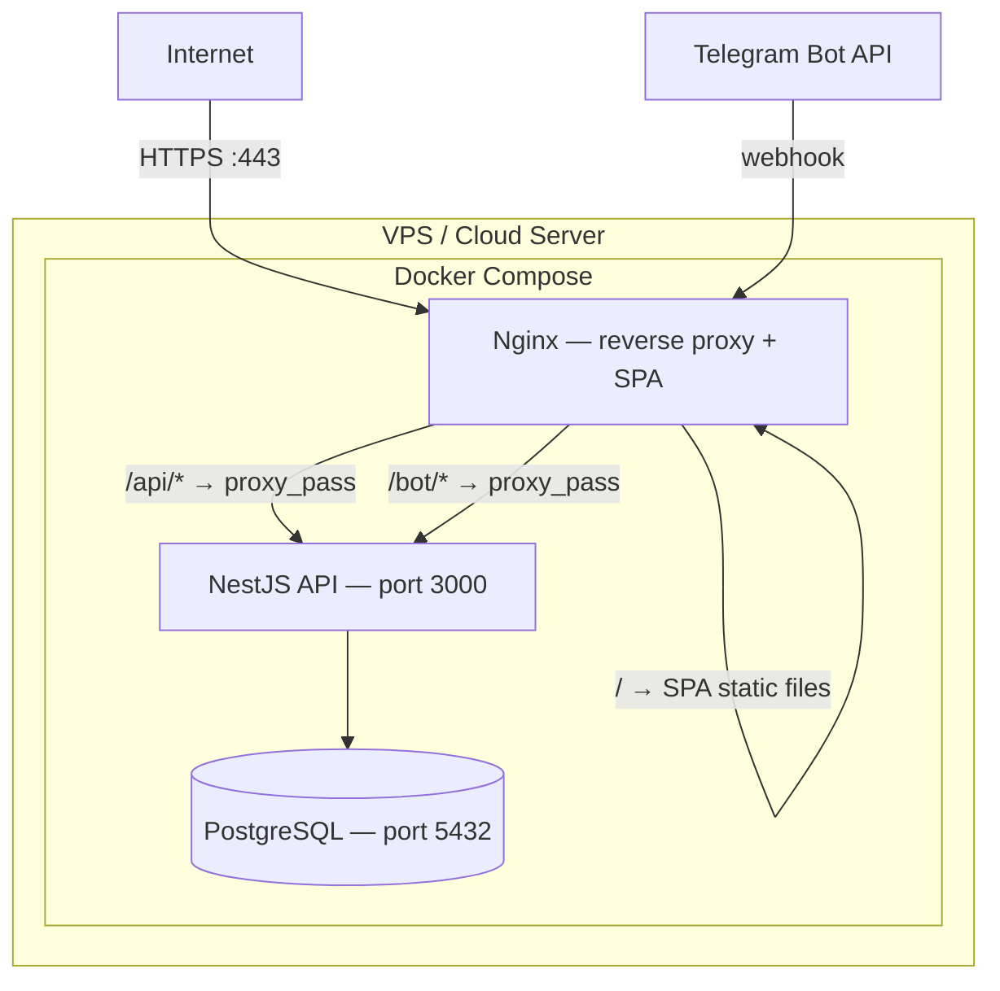

# WoofTennis — Деплой и инфраструктура

## Архитектура деплоя



## Docker Compose

### docker-compose.yml

```yaml
version: '3.8'

services:
  postgres:
    image: postgres:15-alpine
    container_name: wooftennis-db
    restart: unless-stopped
    environment:
      POSTGRES_DB: ${DB_DATABASE}
      POSTGRES_USER: ${DB_USERNAME}
      POSTGRES_PASSWORD: ${DB_PASSWORD}
    volumes:
      - postgres_data:/var/lib/postgresql/data
    ports:
      - "127.0.0.1:5432:5432"
    healthcheck:
      test: ["CMD-SHELL", "pg_isready -U ${DB_USERNAME} -d ${DB_DATABASE}"]
      interval: 10s
      timeout: 5s
      retries: 5

  api:
    build:
      context: ./backend
      dockerfile: Dockerfile
    container_name: wooftennis-api
    restart: unless-stopped
    depends_on:
      postgres:
        condition: service_healthy
    environment:
      NODE_ENV: production
      DB_HOST: postgres
      DB_PORT: 5432
      DB_USERNAME: ${DB_USERNAME}
      DB_PASSWORD: ${DB_PASSWORD}
      DB_DATABASE: ${DB_DATABASE}
      JWT_SECRET: ${JWT_SECRET}
      TELEGRAM_BOT_TOKEN: ${TELEGRAM_BOT_TOKEN}
      TELEGRAM_WEBHOOK_URL: ${TELEGRAM_WEBHOOK_URL}
      TELEGRAM_WEBHOOK_SECRET: ${TELEGRAM_WEBHOOK_SECRET}
      TELEGRAM_MINI_APP_URL: ${TELEGRAM_MINI_APP_URL}
      PORT: 3000
    volumes:
      - uploads:/app/uploads
    ports:
      - "127.0.0.1:3000:3000"

  nginx:
    image: nginx:alpine
    container_name: wooftennis-nginx
    restart: unless-stopped
    depends_on:
      - api
    ports:
      - "80:80"
      - "443:443"
    volumes:
      - ./nginx/nginx.conf:/etc/nginx/nginx.conf:ro
      - ./nginx/conf.d:/etc/nginx/conf.d:ro
      - ./frontend/dist:/usr/share/nginx/html:ro
      - ./certbot/conf:/etc/letsencrypt:ro
      - ./certbot/www:/var/www/certbot:ro
      - uploads:/app/uploads:ro

  certbot:
    image: certbot/certbot
    container_name: wooftennis-certbot
    volumes:
      - ./certbot/conf:/etc/letsencrypt
      - ./certbot/www:/var/www/certbot
    entrypoint: "/bin/sh -c 'trap exit TERM; while :; do certbot renew; sleep 12h & wait $${!}; done;'"

volumes:
  postgres_data:
  uploads:
```

### Backend Dockerfile

```dockerfile
FROM node:20-alpine AS builder

WORKDIR /app
COPY package*.json ./
RUN npm ci
COPY . .
RUN npm run build

FROM node:20-alpine AS runner

WORKDIR /app
COPY --from=builder /app/dist ./dist
COPY --from=builder /app/node_modules ./node_modules
COPY --from=builder /app/package*.json ./

RUN mkdir -p uploads

EXPOSE 3000
CMD ["node", "dist/main.js"]
```

### Nginx Configuration

```nginx
# nginx/conf.d/default.conf

upstream api_backend {
    server api:3000;
}

server {
    listen 80;
    server_name wooftennis.com;

    location /.well-known/acme-challenge/ {
        root /var/www/certbot;
    }

    location / {
        return 301 https://$host$request_uri;
    }
}

server {
    listen 443 ssl http2;
    server_name wooftennis.com;

    ssl_certificate /etc/letsencrypt/live/wooftennis.com/fullchain.pem;
    ssl_certificate_key /etc/letsencrypt/live/wooftennis.com/privkey.pem;

    # SPA — React frontend
    location / {
        root /usr/share/nginx/html;
        index index.html;
        try_files $uri $uri/ /index.html;
    }

    # API proxy
    location /api/ {
        proxy_pass http://api_backend;
        proxy_set_header Host $host;
        proxy_set_header X-Real-IP $remote_addr;
        proxy_set_header X-Forwarded-For $proxy_add_x_forwarded_for;
        proxy_set_header X-Forwarded-Proto $scheme;
    }

    # Bot webhook proxy
    location /bot/ {
        proxy_pass http://api_backend;
        proxy_set_header Host $host;
        proxy_set_header X-Real-IP $remote_addr;
        proxy_set_header X-Forwarded-For $proxy_add_x_forwarded_for;
        proxy_set_header X-Forwarded-Proto $scheme;
    }

    # Uploaded files (photos)
    location /uploads/ {
        alias /app/uploads/;
        expires 30d;
        add_header Cache-Control "public, immutable";
    }

    # Static assets caching
    location ~* \.(js|css|png|jpg|jpeg|gif|ico|svg|woff2|woff|ttf)$ {
        root /usr/share/nginx/html;
        expires 1y;
        add_header Cache-Control "public, immutable";
    }
}
```

## Env-переменные

### .env.example

```bash
# ======== Database ========
DB_DATABASE=wooftennis
DB_USERNAME=wooftennis
DB_PASSWORD=CHANGE_ME_strong_password

# ======== JWT ========
JWT_SECRET=CHANGE_ME_random_32_char_string

# ======== Telegram ========
TELEGRAM_BOT_TOKEN=123456:ABC-DEF...
TELEGRAM_WEBHOOK_URL=https://wooftennis.com/bot/webhook
TELEGRAM_WEBHOOK_SECRET=CHANGE_ME_random_string
TELEGRAM_MINI_APP_URL=https://wooftennis.com

# ======== Frontend (build time) ========
VITE_API_URL=https://wooftennis.com
```

## Процедура деплоя

### Первоначальная установка

```bash
# 1. Клонировать репозиторий на сервер
git clone git@github.com:user/wooftennis.git
cd wooftennis

# 2. Скопировать и заполнить .env
cp .env.example .env
# Отредактировать .env

# 3. Собрать фронтенд
cd frontend
npm ci
npm run build   # Результат в frontend/dist/
cd ..

# 4. Получить SSL-сертификат (первый раз)
# Сначала запустить nginx без SSL, с only acme-challenge
docker compose up -d nginx
docker compose run certbot certonly --webroot \
  -w /var/www/certbot \
  -d wooftennis.com \
  --agree-tos --email admin@wooftennis.com

# 5. Запустить всё
docker compose up -d

# 6. Применить миграции
docker compose exec api npm run migration:run
```

### Обновление

```bash
# 1. Забрать изменения
git pull origin main

# 2. Пересобрать фронтенд (если менялся)
cd frontend && npm ci && npm run build && cd ..

# 3. Пересобрать и перезапустить API (если менялся)
docker compose build api
docker compose up -d api

# 4. Применить миграции (если есть новые)
docker compose exec api npm run migration:run
```

## CI/CD (GitHub Actions)

### .github/workflows/deploy.yml

```yaml
name: Deploy

on:
  push:
    branches: [main]

jobs:
  test:
    runs-on: ubuntu-latest
    services:
      postgres:
        image: postgres:15-alpine
        env:
          POSTGRES_DB: wooftennis_test
          POSTGRES_USER: test
          POSTGRES_PASSWORD: test
        ports:
          - 5432:5432
        options: >-
          --health-cmd pg_isready
          --health-interval 10s
          --health-timeout 5s
          --health-retries 5
    steps:
      - uses: actions/checkout@v4
      - uses: actions/setup-node@v4
        with:
          node-version: 20
          cache: npm
          cache-dependency-path: |
            backend/package-lock.json
            frontend/package-lock.json

      - name: Install & test backend
        working-directory: backend
        run: |
          npm ci
          npm run lint
          npm run test
        env:
          DB_HOST: localhost
          DB_PORT: 5432
          DB_USERNAME: test
          DB_PASSWORD: test
          DB_DATABASE: wooftennis_test
          JWT_SECRET: test-secret
          TELEGRAM_BOT_TOKEN: test-token

      - name: Install & build frontend
        working-directory: frontend
        run: |
          npm ci
          npm run lint
          npm run build
        env:
          VITE_API_URL: https://wooftennis.com

  deploy:
    needs: test
    runs-on: ubuntu-latest
    steps:
      - name: Deploy to server
        uses: appleboy/ssh-action@v1
        with:
          host: ${{ secrets.SERVER_HOST }}
          username: ${{ secrets.SERVER_USER }}
          key: ${{ secrets.SERVER_SSH_KEY }}
          script: |
            cd /opt/wooftennis
            git pull origin main
            cd frontend && npm ci && npm run build && cd ..
            docker compose build api
            docker compose up -d api
            docker compose exec -T api npm run migration:run
```

## Мониторинг и логирование

### Логи

```bash
# Просмотр логов API
docker compose logs -f api

# Просмотр логов всех сервисов
docker compose logs -f

# Логи Nginx
docker compose logs -f nginx
```

### Healthcheck endpoint

В NestJS добавить `GET /health`:

```typescript
@Get('health')
health() {
  return { status: 'ok', timestamp: new Date().toISOString() };
}
```

### Бэкап базы данных

```bash
# Создание бэкапа
docker compose exec postgres pg_dump -U wooftennis wooftennis > backup_$(date +%Y%m%d).sql

# Восстановление
docker compose exec -T postgres psql -U wooftennis wooftennis < backup_20260413.sql
```

Рекомендуется настроить cron-задачу для ежедневного бэкапа:

```bash
# crontab -e
0 3 * * * cd /opt/wooftennis && docker compose exec -T postgres pg_dump -U wooftennis wooftennis | gzip > /opt/backups/wooftennis_$(date +\%Y\%m\%d).sql.gz
```
