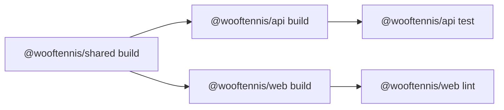

# WoofTennis — Структура монорепозитория

## Обоснование

Монорепозиторий выбран по следующим причинам:
- Фронтенд и бэкенд написаны на TypeScript — общие типы, enum'ы и константы выносятся в shared-пакет без дублирования.
- Атомарные коммиты: изменение API-контракта + обновление фронтенда в одном PR.
- Единый CI/CD pipeline с кэшированием сборки через Turborepo.
- Упрощённый onboarding: `npm install` в корне — и всё работает.

## Инструменты

| Инструмент | Назначение |
|---|---|
| **npm workspaces** | Управление зависимостями между пакетами, единый `node_modules` в корне, hoisting |
| **Turborepo** | Оркестрация задач (`build`, `lint`, `test`), кэширование результатов, параллельный запуск |

## Корневая структура

```
wooftennis/
├── package.json                 # Корневой: workspaces, devDependencies, scripts
├── package-lock.json
├── turbo.json                   # Turborepo: pipeline tasks
├── tsconfig.base.json           # Базовый tsconfig — наследуется всеми пакетами
├── .gitignore
├── .env.example                 # Пример env-переменных (общий)
├── docker-compose.yml           # Запуск всего стека
├── nginx/
│   └── conf.d/
│       └── default.conf
├── docs/                        # Архитектурная документация
│   ├── 01-overview.md
│   ├── ...
│   └── 10-monorepo-structure.md
├── .github/
│   └── workflows/
│       └── ci.yml               # GitHub Actions
├── apps/
│   ├── api/                     # NestJS backend
│   │   ├── package.json         # name: @wooftennis/api
│   │   ├── tsconfig.json        # extends ../../tsconfig.base.json
│   │   ├── nest-cli.json
│   │   ├── Dockerfile
│   │   └── src/
│   │       └── ...              # см. 06-backend-structure.md
│   └── web/                     # React frontend
│       ├── package.json         # name: @wooftennis/web
│       ├── tsconfig.json        # extends ../../tsconfig.base.json
│       ├── vite.config.ts
│       ├── tailwind.config.ts
│       ├── index.html
│       └── src/
│           └── ...              # см. 05-frontend-structure.md
└── packages/
    └── shared/                  # Общие типы и утилиты
        ├── package.json         # name: @wooftennis/shared
        ├── tsconfig.json
        └── src/
            ├── index.ts         # Barrel export
            ├── types/
            │   ├── user.ts
            │   ├── location.ts
            │   ├── schedule-template.ts
            │   ├── slot.ts
            │   ├── booking.ts
            │   ├── play-session.ts
            │   ├── review.ts
            │   ├── makeup-debt.ts
            │   ├── notification.ts
            │   └── api.ts       # PaginatedResponse, ApiError
            ├── enums/
            │   ├── slot-status.enum.ts
            │   ├── slot-source.enum.ts
            │   ├── booking-status.enum.ts
            │   ├── play-session-status.enum.ts
            │   ├── participant-status.enum.ts
            │   ├── makeup-status.enum.ts
            │   └── notification-type.enum.ts
            └── constants/
                ├── days-of-week.ts
                └── slot-durations.ts
```

## Конфигурация

### Корневой package.json

```json
{
  "name": "wooftennis",
  "private": true,
  "workspaces": [
    "apps/*",
    "packages/*"
  ],
  "scripts": {
    "dev": "turbo dev",
    "build": "turbo build",
    "lint": "turbo lint",
    "test": "turbo test",
    "dev:api": "turbo dev --filter=@wooftennis/api",
    "dev:web": "turbo dev --filter=@wooftennis/web",
    "build:api": "turbo build --filter=@wooftennis/api",
    "build:web": "turbo build --filter=@wooftennis/web",
    "db:migration:generate": "npm run migration:generate --workspace=@wooftennis/api",
    "db:migration:run": "npm run migration:run --workspace=@wooftennis/api"
  },
  "devDependencies": {
    "turbo": "^2",
    "typescript": "^5"
  }
}
```

### turbo.json

```json
{
  "$schema": "https://turbo.build/schema.json",
  "tasks": {
    "build": {
      "dependsOn": ["^build"],
      "outputs": ["dist/**"]
    },
    "dev": {
      "cache": false,
      "persistent": true
    },
    "lint": {
      "dependsOn": ["^build"]
    },
    "test": {
      "dependsOn": ["^build"]
    }
  }
}
```

**Граф зависимостей задач:**



Turborepo автоматически определяет порядок: `shared` собирается первым, затем параллельно `api` и `web`.

### tsconfig.base.json

```json
{
  "compilerOptions": {
    "target": "ES2022",
    "module": "ESNext",
    "moduleResolution": "bundler",
    "lib": ["ES2022"],
    "strict": true,
    "esModuleInterop": true,
    "skipLibCheck": true,
    "forceConsistentCasingInFileNames": true,
    "resolveJsonModule": true,
    "isolatedModules": true,
    "declaration": true,
    "declarationMap": true,
    "sourceMap": true,
    "composite": true
  }
}
```

### packages/shared/package.json

```json
{
  "name": "@wooftennis/shared",
  "version": "0.0.0",
  "private": true,
  "main": "./src/index.ts",
  "types": "./src/index.ts",
  "scripts": {
    "build": "tsc --build",
    "lint": "tsc --noEmit"
  },
  "devDependencies": {
    "typescript": "^5"
  }
}
```

### apps/api/package.json (ключевые поля)

```json
{
  "name": "@wooftennis/api",
  "private": true,
  "dependencies": {
    "@wooftennis/shared": "*",
    "@nestjs/core": "^10",
    ...
  }
}
```

### apps/web/package.json (ключевые поля)

```json
{
  "name": "@wooftennis/web",
  "private": true,
  "dependencies": {
    "@wooftennis/shared": "*",
    "react": "^18",
    ...
  }
}
```

## Пакет @wooftennis/shared

### Что содержит

Пакет `@wooftennis/shared` — единый источник правды для типов, которые используются и на фронтенде, и на бэкенде.

| Директория | Содержимое | Пример |
|---|---|---|
| `types/` | TypeScript интерфейсы API-сущностей и ответов | `User`, `Slot`, `Booking`, `PaginatedResponse<T>` |
| `enums/` | Enum-типы, совпадающие с PostgreSQL enum'ами | `SlotStatus`, `BookingStatus`, `NotificationType` |
| `constants/` | Разделяемые константы | Дни недели, допустимые длительности слотов |

### Пример типов

```typescript
// types/user.ts
export interface User {
  id: string;
  telegramId: number;
  firstName: string;
  lastName: string | null;
  username: string | null;
  photoUrl: string | null;
  isCoach: boolean;
  createdAt: string;
  updatedAt: string;
}

export interface UserStats {
  totalBookingsAsPlayer: number;
  totalBookingsAsCoach: number;
  avgStarRatingAsPlayer: number | null;
  avgStarRatingAsCoach: number | null;
  pendingMakeupDebts: number;
}

export interface UserWithStats extends User {
  stats: UserStats;
}
```

```typescript
// types/booking.ts
import { BookingStatus } from '../enums/booking-status.enum';

export interface Booking {
  id: string;
  slotId: string;
  playerId: string;
  status: BookingStatus;
  isSplitOpen: boolean;
  createdAt: string;
  updatedAt: string;
}

export interface BookingDetailed extends Booking {
  slot: SlotWithLocation;
  coach: UserPublic;
  splitPartners: UserPublic[];
  review: Review | null;
}
```

```typescript
// types/api.ts
export interface PaginatedResponse<T> {
  items: T[];
  total: number;
  page: number;
  limit: number;
}

export interface ApiError {
  statusCode: number;
  message: string;
  error: string;
}
```

### Пример enum'ов

```typescript
// enums/booking-status.enum.ts
export enum BookingStatus {
  Confirmed = 'confirmed',
  Cancelled = 'cancelled',
  Completed = 'completed',
  NoShow = 'no_show',
}

// enums/slot-status.enum.ts
export enum SlotStatus {
  Available = 'available',
  Booked = 'booked',
  Full = 'full',
  Cancelled = 'cancelled',
}

// enums/notification-type.enum.ts
export enum NotificationType {
  BookingCreated = 'booking_created',
  BookingCancelled = 'booking_cancelled',
  BookingReminder = 'booking_reminder',
  BookingCompleted = 'booking_completed',
  SplitJoined = 'split_joined',
  SlotCancelled = 'slot_cancelled',
  ReviewReceived = 'review_received',
  MakeupAssigned = 'makeup_assigned',
  MakeupResolved = 'makeup_resolved',
  PlaySessionJoined = 'play_session_joined',
}
```

### Пример констант

```typescript
// constants/days-of-week.ts
export const DAYS_OF_WEEK = [
  { value: 0, label: 'Понедельник', short: 'Пн' },
  { value: 1, label: 'Вторник', short: 'Вт' },
  { value: 2, label: 'Среда', short: 'Ср' },
  { value: 3, label: 'Четверг', short: 'Чт' },
  { value: 4, label: 'Пятница', short: 'Пт' },
  { value: 5, label: 'Суббота', short: 'Сб' },
  { value: 6, label: 'Воскресенье', short: 'Вс' },
] as const;

// constants/slot-durations.ts
export const ALLOWED_SLOT_DURATIONS = [30, 60, 90, 120] as const;
export type SlotDuration = typeof ALLOWED_SLOT_DURATIONS[number];
```

### Barrel export

```typescript
// index.ts
export * from './types/user';
export * from './types/location';
export * from './types/schedule-template';
export * from './types/slot';
export * from './types/booking';
export * from './types/play-session';
export * from './types/review';
export * from './types/makeup-debt';
export * from './types/notification';
export * from './types/api';

export * from './enums/slot-status.enum';
export * from './enums/slot-source.enum';
export * from './enums/booking-status.enum';
export * from './enums/play-session-status.enum';
export * from './enums/participant-status.enum';
export * from './enums/makeup-status.enum';
export * from './enums/notification-type.enum';

export * from './constants/days-of-week';
export * from './constants/slot-durations';
```

## Использование shared-пакета

### В apps/api (NestJS)

```typescript
// apps/api/src/modules/bookings/bookings.service.ts
import { BookingStatus, SlotStatus } from '@wooftennis/shared';

async cancelBooking(bookingId: string, userId: string) {
  const booking = await this.bookingRepo.findOne({ where: { id: bookingId } });
  booking.status = BookingStatus.Cancelled;
  // ...
}
```

TypeORM-сущности используют enum'ы из shared:

```typescript
// apps/api/src/modules/bookings/entities/booking.entity.ts
import { BookingStatus } from '@wooftennis/shared';

@Entity()
export class BookingEntity {
  @Column({ type: 'enum', enum: BookingStatus, default: BookingStatus.Confirmed })
  status: BookingStatus;
}
```

### В apps/web (React)

```typescript
// apps/web/src/components/booking/BookingCard.tsx
import { BookingDetailed, BookingStatus } from '@wooftennis/shared';

function BookingCard({ booking }: { booking: BookingDetailed }) {
  const statusLabel = {
    [BookingStatus.Confirmed]: 'Подтверждено',
    [BookingStatus.Cancelled]: 'Отменено',
    [BookingStatus.Completed]: 'Завершено',
    [BookingStatus.NoShow]: 'Не пришёл',
  }[booking.status];
  // ...
}
```

## Команды разработки

| Команда | Описание |
|---|---|
| `npm install` | Установить все зависимости (корень + все пакеты) |
| `npm run dev` | Запустить dev-серверы api и web параллельно |
| `npm run dev:api` | Только бэкенд (NestJS watch mode) |
| `npm run dev:web` | Только фронтенд (Vite dev server) |
| `npm run build` | Собрать shared → api + web |
| `npm run lint` | Линтинг всех пакетов |
| `npm run test` | Тесты всех пакетов |
| `npm run db:migration:generate` | Сгенерировать миграцию TypeORM |
| `npm run db:migration:run` | Применить миграции |

## Добавление нового shared-типа

1. Создать/обновить файл в `packages/shared/src/types/` или `packages/shared/src/enums/`.
2. Добавить re-export в `packages/shared/src/index.ts`.
3. Использовать в `apps/api` и/или `apps/web` через `import { ... } from '@wooftennis/shared'`.
4. Turborepo автоматически пересоберёт зависимые пакеты.
